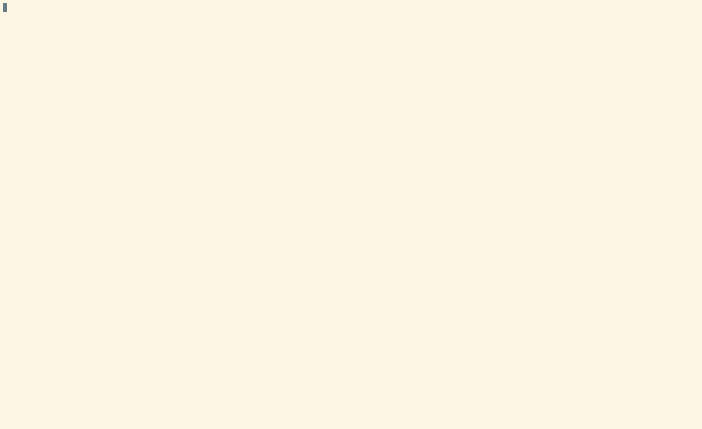

## Game of Life

https://en.wikipedia.org/wiki/Conway%27s_Game_of_Life

### Building

```
make
```

### Running

Without any arguments, the program will start the world from `worlds/test.world` that contains some still lifes and some oscilliators:
```
bin/gol
```

To run the simulation with some other world, specify the path to the world file:
```
bin/gol worlds/gosper-glider-gun.world
```


